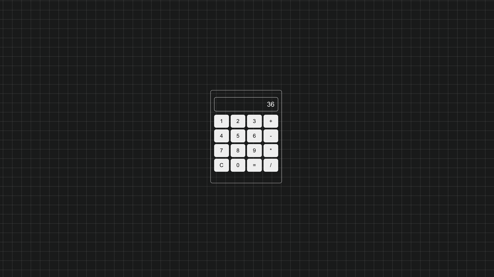

# React Calculator with Keyboard Support



## Project Overview
This project is a modern, fully responsive calculator application built using **React** and **styled-components**. It supports keyboard input, allowing seamless user interaction, and features a clean, minimalist UI with a visually appealing gradient background. The calculator performs essential arithmetic operations, handles invalid inputs gracefully, and supports backspace functionality for better user experience.

## Features
- **Keyboard Support**: Use your keyboard for input, including numbers, operators, backspace, and `Enter` for evaluation.
- **Responsive Design**: The application is designed to work across various screen sizes.
- **Dynamic Output**: Real-time calculations displayed in the output area.
- **Clean and Intuitive UI**: Simple, grid-based layout with hover and active effects on buttons.
- **Error Handling**: Displays `Error` for invalid expressions to ensure reliability.

## What I Learned
### **1. React Fundamentals**
- Understanding and utilizing React hooks like `useState` and `useEffect` to manage state and handle side effects.
- Dynamically rendering components using `map` and handling events efficiently.

### **2. Styling with Styled-Components**
- Creating reusable and modular CSS directly within JavaScript components.
- Leveraging advanced styling techniques, such as gradients and hover effects.

### **3. User Interaction Handling**
- Adding keyboard support by listening for keypress events using `useEffect`.
- Ensuring the app gracefully handles user inputs, including backspace and invalid entries.

### **4. Safe Evaluation with Math.js**
- Implementing arithmetic operations using the **math.js** library for safety and precision.
- Avoiding the use of `eval()` to adhere to best practices and security standards.

## Technologies Used
- **React**: For building the user interface and handling state management.
- **Styled-Components**: For styling components with a modular and reusable approach.
- **Math.js**: For safe and precise evaluation of mathematical expressions.
- **HTML5 & CSS3**: For additional structure and styling.

## How to Run the Project
1. Clone the repository:
   ```bash
   git clone https://github.com/Swyampatel/react-calculator-with-keyboard-support.git
   ```
2. Navigate to the project directory:
   ```bash
   cd react-calculator-with-keyboard-support
   ```
3. Install dependencies:
   ```bash
   npm install
   ```
4. Start the development server:
   ```bash
   npm start
   ```
5. Open [http://localhost:3000](http://localhost:3000) in your browser to view the app.

## Challenges Overcome
- **Keyboard Input Handling**: Ensuring seamless interaction with both mouse and keyboard while managing edge cases like invalid inputs and backspace.
- **Responsive Layout**: Creating a layout that adapts beautifully across devices of varying screen sizes.
- **State Management**: Effectively managing the dynamic output and button interactions with React hooks.

## Future Enhancements
- **Advanced Features**: Add functionalities like square root, percentage, and memory buttons.
- **Dark Mode**: Implement a toggle for light and dark themes.
- **Accessibility**: Improve accessibility with proper ARIA roles and semantic HTML.

## Why This Project Matters
This project showcases my ability to:
1. Build clean and user-friendly interfaces with React.
2. Solve real-world problems using best practices in state management and event handling.
3. Design responsive and visually appealing UIs that function seamlessly across devices.

It highlights my technical expertise, attention to detail, and passion for creating interactive web applications that deliver a great user experience.

---

If you're a potential employer looking for someone with strong React and front-end development skills, this project demonstrates my ability to handle complex requirements while maintaining code quality and user-centric design.
